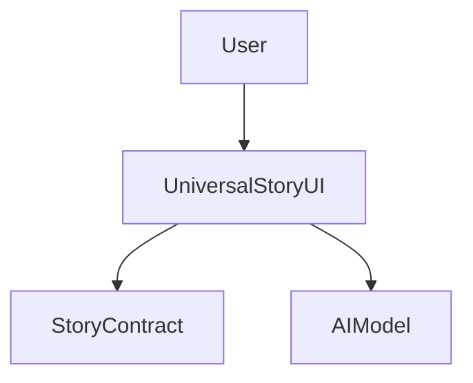
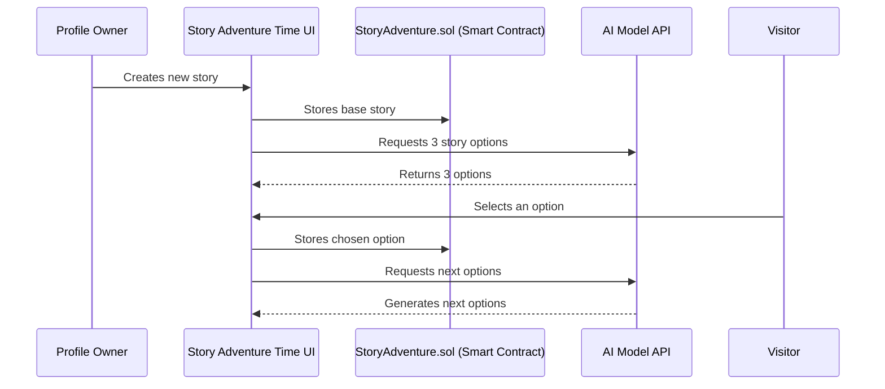

# LUKSO Storyline Mini-App 📖✨

**Turn your LUKSO profile into an interactive, AI-powered adventure!** Visitors shape your story, deciding on what happens next, making your digital identity more engaging and unpredictable. 🚀

## 🚀 Features
- **User-driven Story Evolution** – Visitors decide on the next chapter of your story.
- **AI-Generated Choices** – An AI model suggests multiple paths based on the existing storyline.
- **Decentralized & Transparent** – All story decisions are recorded on-chain for authenticity.
- **Engaging Profiles** – Make your profile more than just a static page—turn it into a saga!

## 🎭 How It Works
1. **Start Your Story** – Write an initial storyline for your profile.
2. **AI Suggests Next Steps** – The system generates 3 possible continuations.
3. **Visitors-driven** – Your profile visitors choose which path to take.

## 🛠️ Tech Stack
- **Blockchain**: LUKSO [Universal Profiles](https://universal.page/universal-profiles)
- **Smart Contracts**: Solidity-based contracts for storing story data. [StoryAdventure.sol](contracts/StoryAdventure.sol)
- **AI Model**: GPT-based text generation
- **Frontend**: [tools-up-provider](https://github.com/lukso-network/tools-up-provider)

## 🏗️ Architecture diagram


## 🧩 Sequence Diagram


## 🚀 Getting Started

### Prerequisites
- Node.js & yarn
- LUKSO Universal Profile

### Installation
```sh
git clone https://github.com/democrazyfi/universal-story-lukso-miniapp
cd universal-story-lukso-miniapp
yarn install
```

### Running the App
```sh
yarn dev
```

## 📜 License
This project is licensed under the **MIT License**.

